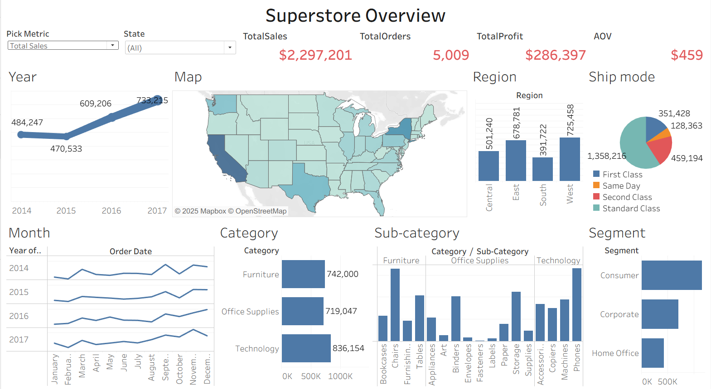
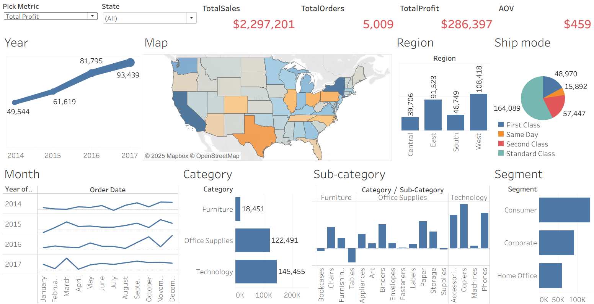
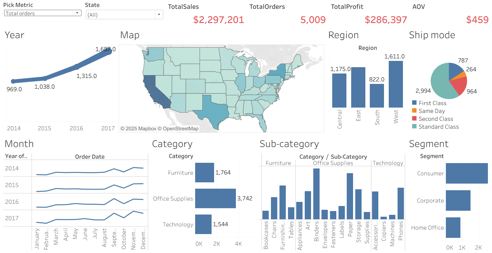
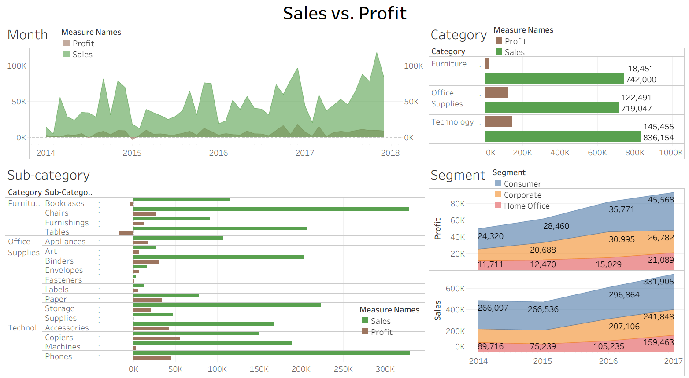
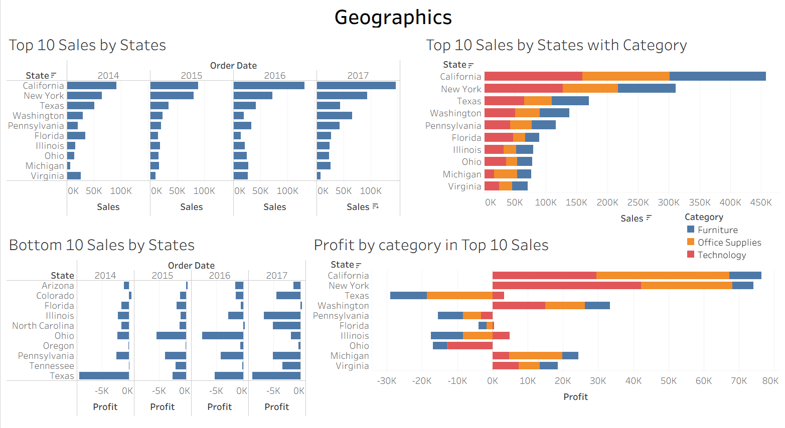

# Superstore Analysis and Data Visualization

## Dataset description: https://www.kaggle.com/datasets/vivek468/superstore-dataset-final/data

## Dashboards

**KPIs:**
- Total Sales: $2.29 million
- Total Orders: 5009
- Total Profit $286 thousand
- AOV: $459

In the 2014-2017 period, Superstore earned $2.29 million revenue but the profit was only $286K. The company had a healthy revenue but the margins (profitability) is slimmer compared to sales volume.

**Time trend (2014-2017):**
- Sales steadily increased over time (especially in 2016-2017).
- Profit also grew up but less steep.
- Orders increase gradually.
=> Strong growth, but profitability should be monitored.

**Regional Performance:**
- West was the strongest region (highest sales, profit, and orders).
- East also performed well but with tighter margins.
- Central showed weaker profit contribution (sales high, but profit relatively low).
- South lagged behind both in orders and profit.
=> Expansion opportunites in Central and South, and profitability strategies need adjustment.

**Category and Sub-category:**
- Technology was the top category by sales, followed by Office Supplies, then Furnitures.
- Withhin sub-category:
- - Phones, copiers, Accessories, and Chairs drove large portions of revenue.
- - Some categories (Tables, Bookcases, Machines) dragged progit.
  - => Tech was the growth driver, but Furniture seems riskier (profit margins weaker).

**Customer Segments:**
- Consumer was the largest segment, followed by Corporate, then Home Office.
- Consumer drove bulk of orders and revenue.
- Corporate segment had strong contribution but smaller share.
=> Diversity into Corporate and Home Office to balance dependency on Consumer.

**Shipping Mode:**
- Standard Class dominated.
- Second and First Class much smaller.
- Same Day negligible.
=> Most customers preferred cost-effective shipping over speed.

**Geographics:**
- California, New York, and Texas stood out as the biggest contributors to revenue.
- Some midwest and Southern states contributed little.
=> Growth opportunites in other states, but focus on profitability hotspots (CA< NY, TX).

**Keys:**
- Revenue was growing steadily, but profitability lagged behind.
- West and East were strong; Central and South need margin improvements.
- Technology category was the star performer; Furniture had risk.
- Consumers dominated the business.
- Focus on profitable SKUs and leverage regions with higher margins.

**Sales and Profit Trends**
- Total Sales show a clear upward trend year-over-yaer.
- Total Profit also shows a positive trajectory.

**Product and Category Performance**
- Technology performed the highest proportion in Sales and Profit.
- Even though Office Supplies was the lest contributor to the Sales but earned the second place in Profit.
- Funiture had the least Profit in spite of having a large amount in Sales. Especially, its sub-categories, including Tables and Bookcases, was experiencing significant losses.

**Segment**
- From 2014 to 2017, the Consumer segment was always the largest, followed by Corporate, and then Home Office.

**Keys:**
- Technology category was a major driver of sales and profits.
- While the Furniture category generated significant revenue, it was the least profitable and included sub-categories (Bookcases and Tables) that were consistently losing money.

**Top Performing States in Sales**
California, New York, and Texas consistently led in sales across all years. Washington and Pennsylvania also ranked high.

**Bottom Performing States in Profit**
Even though Texas ranked high in Sales but having a significant negative profit. Similarly for Illinois and Pennsylvania.

**Category in States**
- All categories had losses in Pennsylvania and Ohio.
- Furniture and Office Supplies had biggest losses in Texas, Florida and Illinois where Technology still earned profit.

**Keys:**
- There was a disconnect between sales and profit in states (Texas, Illinois, Pennsylvania). They were top sales generators but having some of the biggest losses.

## Recommendation
- Expand tailored marketing (bulk discounts, loyalty programs or premium services,...) for Corporate and Home Office.
- Possibly downgrade on marketing and logistics investment in West and East (these regions were proven profit centers).
- Renegotiate supplier costs, adjust prices, or drop unprofitable SKUs in Furniture category (especially Tables and Bookcases).
- Investigate why margins in Central and Sounth regions were weaker. Conduct a detailed review of operations and pricing strategies in these states (Texas, Illinois, Pennsylvania). Investigate potential issues such as high shipping costs, aggressive discounting, or high return rate. 
